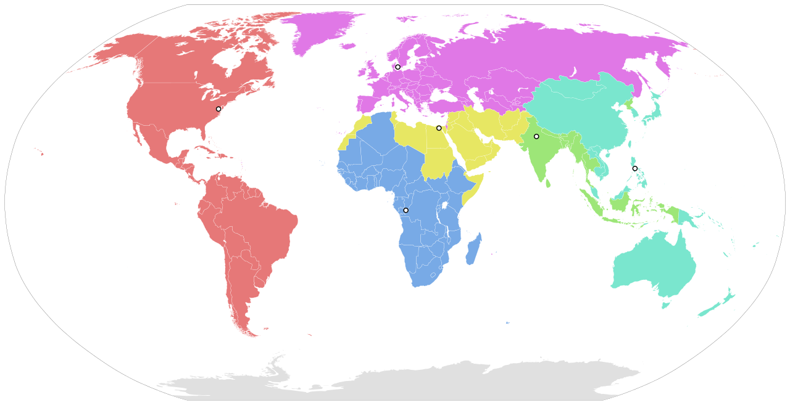
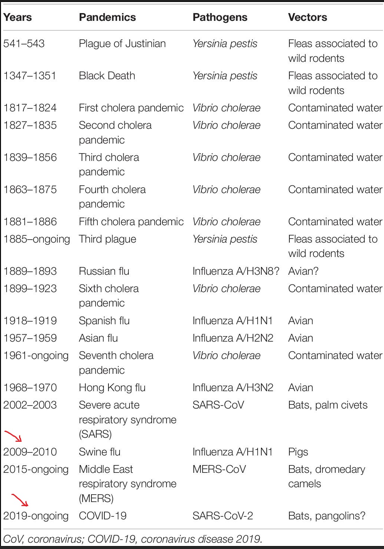

## Is it possible to predict the future pandemic by monitoring influenza activity?

```{r ,include=FALSE}
library(ggcorrplot)
library(tidyverse)
library(ggplot2)
library(lubridate)
library(gridExtra)


```


```{r ,include=FALSE}
flu<-readr::read_csv("flu.csv")

```


```{r ,include=FALSE}
flu<-flu|>select(WHOREGION,FLUSEASON,HEMISPHERE,COUNTRY_AREA_TERRITORY,ISO_WEEKSTARTDATE,
                 ISO_YEAR,SPEC_PROCESSED_NB,INF_ALL,
                 INF_NEGATIVE,HUMAN_CORONA,METAPNEUMO,PARAINFLUENZA,RHINO,
              RSV,INF_A,INF_B)
```

```{r ,include=FALSE}
flu<-rename(flu,counry=COUNTRY_AREA_TERRITORY,
       date=ISO_WEEKSTARTDATE,
       year=ISO_YEAR,
       n_tested_samples=SPEC_PROCESSED_NB,
       flu_A=INF_A,
       flu_B=INF_B,
       total_flu=INF_ALL)
```


### structure the data
```{r ,echo=FALSE,include=TRUE}
str(flu)

```

```{r ,echo=FALSE,include=TRUE}

```


### Summary statistics
```{r ,echo=FALSE,include=TRUE}

summary(flu)
```

### Display the first few rows of the dataset
```{r ,echo=FALSE,include=TRUE}
head(flu)
```


```{r ,include=FALSE}
# Check for missing values
sum(is.na(flu))
```


```{r ,echo=FALSE,include=TRUE}
# assign zero for any missing value
flu[is.na(flu)] <- 0
```

```{r ,include=FALSE}
summary<-flu %>%
  group_by(date) %>%
  summarise(flu_A = sum(flu_A), flu_B = sum(flu_B))
  
```

```{r ,include=FALSE}
# create winter seasion column
flu<-flu|>mutate(month=month(date))|>relocate(month)
flu <- flu %>%
  mutate(winter_seasion = case_when(
    (HEMISPHERE=="NH" & month %in% c(12,1,2) ) ~ TRUE,
    (HEMISPHERE=="SH" & month %in% c(6,7,8) ) ~ TRUE,
    # Add more conditions as needed
    TRUE ~ FALSE
  ))
```

### percentage of activation of flu for every WHOREGION

```{r ,echo=FALSE,include=TRUE}
flu|>
  group_by(WHOREGION)|>summarise(percentage=sum(winter_seasion)/n())|>
  arrange(desc(percentage))
```

#### create barchart represent the Percentage of Each WHO Region

```{r ,include=FALSE}
z<-flu|>group_by(WHOREGION)|>summarise(s=sum(total_flu))

z <- mutate(z, percentage = s / sum(s) * 100)

# Create a horizontal bar chart

```

```{r ,echo=FALSE,include=TRUE}
plot2<-ggplot(z, aes(x = percentage, y = fct_reorder(WHOREGION, -percentage))) +
  geom_bar(stat = "identity", fill = "skyblue") +
  labs(title = "Percentage of Each WHO Region",
       x = "Percentage",
       y = "WHO Region") +
  xlab("count by percentage") +
  theme(axis.text.x = element_text(angle = 45, hjust = 1))
  
plot2 +
  geom_text(aes(label = sprintf("%.1f%%", percentage)), vjust = -0.5, size = 4)
```


### linear regression among INF_A and INF_B
```{r ,echo=FALSE,include=TRUE}
flu |>group_by(date)%>%
  summarise(flu_A=sum(flu_A),flu_B=sum(flu_B))|>
  ggplot() +
  aes(x = flu_A,
      y = flu_B) +
  geom_point() +
  geom_smooth(method = "lm", formula = 'y ~ x')+
  annotation_logticks(sides = "l") +
  scale_y_continuous(trans = "pseudo_log")
```

### correlation coefficient
```{r ,echo=FALSE,include=TRUE}
paste("correlation coefficient among INF_A and INF_B  ",cor(summary$flu_A,summary$flu_B))
```


### boxplot for each INF_A and INF_B 

```{r ,include=FALSE}
flu_long <- flu %>%
  pivot_longer(cols = c(flu_A, flu_B), names_to = "Infection_Type", values_to = "Infection_Count")

```

```{r ,echo=FALSE,include=TRUE}
ggplot(flu_long, aes(x = Infection_Type, y = Infection_Count)) +
  geom_boxplot(fill = "skyblue", color = "darkblue") +
  labs(title = "Distribution of Infection Numbers (log scale)", x = "Infection Type",y = expression(paste("Infection Count  ", 10^-3 ))) +
  scale_y_log10() +  # Use log scale for y-axis
  theme_minimal()
```

### Correlation Heatmap of Influenza Variables

```{r ,include=FALSE}

flu_correlation_data <- flu %>%
  filter(year >= 2015) %>%
  select(total_flu, HUMAN_CORONA, METAPNEUMO, PARAINFLUENZA, RHINO, RSV)

# Calculate the correlation matrix
cor_matrix <- cor(flu_correlation_data)


# Plot the heatmap

```


```{r ,echo=FALSE,include=TRUE}
ggcorrplot(cor_matrix, 
           hc.order = TRUE, 
           type = "lower", 
           lab = TRUE, 
           lab_size = 3, 
           method = "circle", 
           colors = c("blue", "white", "red"),
           title = "Correlation Heatmap of Influenza Variables")
```


### create barchart represent Number of infected people 

```{r ,include=FALSE}
summary_flu<-flu |>
  group_by(year=year)%>%
  summarise(s=sum(n_tested_samples))


```

```{r ,echo=FALSE,include=TRUE}
ggplot(summary_flu, aes(x = year, y = s)) + 
  geom_bar(stat = "sum", fill = "blue") +
  labs(title = "Distribution of infection",
       x = "Year",
       y = "Number of tested samples") +
  theme_minimal()+
  scale_y_continuous(labels = scales::comma_format())
```

### Create a Time Series for number of infected people  

```{r ,include=FALSE}
x<-flu|> group_by(year)|>
  summarise(total_flu=sum(total_flu))

x$year <- as.numeric(as.character(x$year))


gathered_data <- x %>%
  gather(variable, value, total_flu)


```

```{r ,echo=FALSE,include=TRUE}
# Create a line chart
ggplot(gathered_data, aes(x = year, y = value, color = variable)) +
  geom_line() +
  labs(title = "Time Series of Variables", y = "Value") +
  scale_color_manual(values = c(
    "total_flu" = "red"
  )) +
  
  theme_minimal()
```

```{r ,echo=FALSE,include=TRUE}


```
